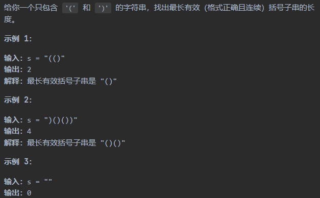

DP的关键步骤

1. 找到重复性（分治）
2. 定义状态数组
3. 列出DP方程

## 题目与解析

### 120_三角形最小路径和

### 53_最大子数组和

### 32_最长有效括号

1. 题目：https://leetcode.cn/problems/longest-valid-parentheses/



2. 题解
> 方法一: 动态规划。分析：定义状态数组dp[i]为从起始到位置i的最长有效括号总数。那么在i这个位置，如果s[i]='('，那么就表示没有
> 能够组合成一对括号的。如果s[i]=')'，那么继续分析i-1这个位置的情况，如果s[i-1]这个位置为'('的话，那么i-1和i可以组成一对有
> 效的括号对，长度加2，即：dp[i]=dp[i-2]+2；如果s[i-1]这个位置为')'的话，那么只有当'...((...))'这种情况的时候，才能组成
> 一组有效的括号对，也就是与i组成有效括号对的位置在 i-dp[i-1]-1, 所以判断i-dp[i-1]-1这个位置的括号类型，如果所以这种情况下
> 的括号能够与i位置组成括号对，同时考虑到i-dp[i-1]-2，这个位置可能存在的括号对，dp方程为: dp[i]=dp[i-1]+dp[i-dp[i-2]-2]+2,


```go
func longestValidParentheses(s string) int {
	size := len(s)
	dp := make([]int, size)

	max := func(a, b int) int {
		if a > b {
			return a
		}
		return b
	}

	maxVal := 0
	for i:=1; i < size;i++ {
		// 如果当前位置的字符是 ) 才能计算
		if s[i] == ')' {
			if s[i-1] == '(' {
				// 初始化并且这个值一直为2
				dp[i] = 2
				if i-2 >= 0 {
					dp[i] = dp[i] + dp[i-2]
				}
			} else if dp[i-1] > 0 { // 如果i-1位置之前的子串是有效的
				if (i-dp[i-1]-1) >= 0 && s[i-dp[i-1]-1] == '(' {
					dp[i] = dp[i-1] + 2
					if i-dp[i-1]-2 >= 0 {
						dp[i] = dp[i] + dp[i-dp[i-1]-2]
					}
				}
			}
		}
		maxVal = max(maxVal, dp[i])
	}

	return maxVal
}
```

### 64_最小路径和
1. 题目: https://leetcode.cn/problems/minimum-path-sum/

2. 题解
> 方法一：动态规划。这个题目是求最小路径和，直接上动态规划。右下角最后一个位置可以由它的上面和左边那个格子走过来，两者较小的
> 就是，再加上最后一个格子的值就是要求的。状态转移方程：
> f(i,j)=min{f(i,j-1), f(i-1,j)} + a(i,j)

```go
func minPathSum(grid [][]int) int {
    // 状态转移方程：f(i,j)=max{f(i,j-1), f(i-1,j)} + a(i,j)
    min := func(a, b int) int {
        if a > b {
            return b
        }
        return a
    }
    
    m := len(grid)
    n := len(grid[0])
    // 初始化
    dp := make([][]int, m)
	// 从0开始初始化
    for i := 0; i < m; i++ {
        dp[i] = make([]int, n)
    }
    
	// 第一个格子初始化
    dp[0][0] = grid[0][0]
    for i := 1; i < m; i++ {
        dp[i][0] = grid[i][0] + dp[i-1][0] // 初始化第一列
    }
    for j := 1; j < n; j++ {
        dp[0][j] = grid[0][j] + dp[0][j-1] //初始化第一行
    }
    
    for i := 1; i < m; i++ {
        for j := 1; j < n; j++ {
            dp[i][j] = min(dp[i][j-1], dp[i-1][j]) + grid[i][j]
        }
    }
    
    return dp[m-1][n-1]
}

```