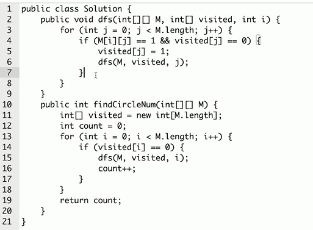

# 字典树和并查集

## 字典树

```go
type Trie struct {
	children [26]*Trie
	isEnd    bool
}

func Constructor() Trie {
	return Trie{}
}

// Insert 我们从字典树的根开始，插入字符串。对于当前字符对应的子节点，有两种情况：
//
//子节点存在。沿着指针移动到子节点，继续处理下一个字符。
//子节点不存在。创建一个新的子节点，记录在 children 数组的对应位置上，然后沿着指针移动到子节点，继续搜索下一个字符。
//重复以上步骤，直到处理字符串的最后一个字符，然后将当前节点标记为字符串的结尾。
//
func (t *Trie) Insert(word string) {
	node := t
	for _, ch := range word {
		// 这个是什么意思呢？
		ch -= 'a'
		// 字符不存在就新增一个节点
		if node.children[ch] == nil {
			node.children[ch] = &Trie{}
		}
		node = node.children[ch]
	}
	node.isEnd = true
}

// SearchPrefix 我们从字典树的根开始，查找前缀。对于当前字符对应的子节点，有两种情况：
//
//子节点存在。沿着指针移动到子节点，继续搜索下一个字符。
//子节点不存在。说明字典树中不包含该前缀，返回空指针。
//重复以上步骤，直到返回空指针或搜索完前缀的最后一个字符。
//
//若搜索到了前缀的末尾，就说明字典树中存在该前缀。此外，若前缀末尾对应节点的 isEnd 为真，则说明字典树中存在该字符串。
//
func (t *Trie) SearchPrefix(prefix string) *Trie {
	node := t
	for _, ch := range prefix {
		ch -= 'a'
		if node.children[ch] == nil {
			return nil
		}
		node = node.children[ch]
	}
	return node
}

func (t *Trie) Search(word string) bool {
	node := t.SearchPrefix(word)
	return node != nil && node.isEnd
}

func (t *Trie) StartWith(prefix string) bool {
	return t.SearchPrefix(prefix) != nil
}
```

## 并查集

组团，配对问题

### 基本操作

* makeSet(s): 建立一个新的并查集，其中包含s个单元素集合。
* unionSet(s): 把元素x和元素y所在的集合合并，要求x和y所在的集合不相交，如果相交就不合并。
* find(x): 找到元素x所在的集合的代表，该操作也可以用于判断两个元素是否位于同一集合，只要将它们各自的代表比较一下即可

```go
type UnionFind struct {
	Count  int
	Parent []int
}

func NewUnionFind(n int) *UnionFind {
	u := &UnionFind{}
	u.Count = n
	u.Parent = make([]int, n)
	for i := 0; i < n; i++ {
		u.Parent[i] = i
	}
	return u
}

func (u *UnionFind) Find(p int) int {
	for p != u.Parent[p] {
		u.Parent[p] = u.Parent[u.Parent[p]]
		p = u.Parent[p]
	}
	return p
}

func (u *UnionFind) Union(p, q int) {
	rootP := u.Find(p)
	rootQ := u.Find(q)
	if rootP == rootQ {
		return
	}
	u.Parent[rootP] = rootQ
	u.Count--
}
```

